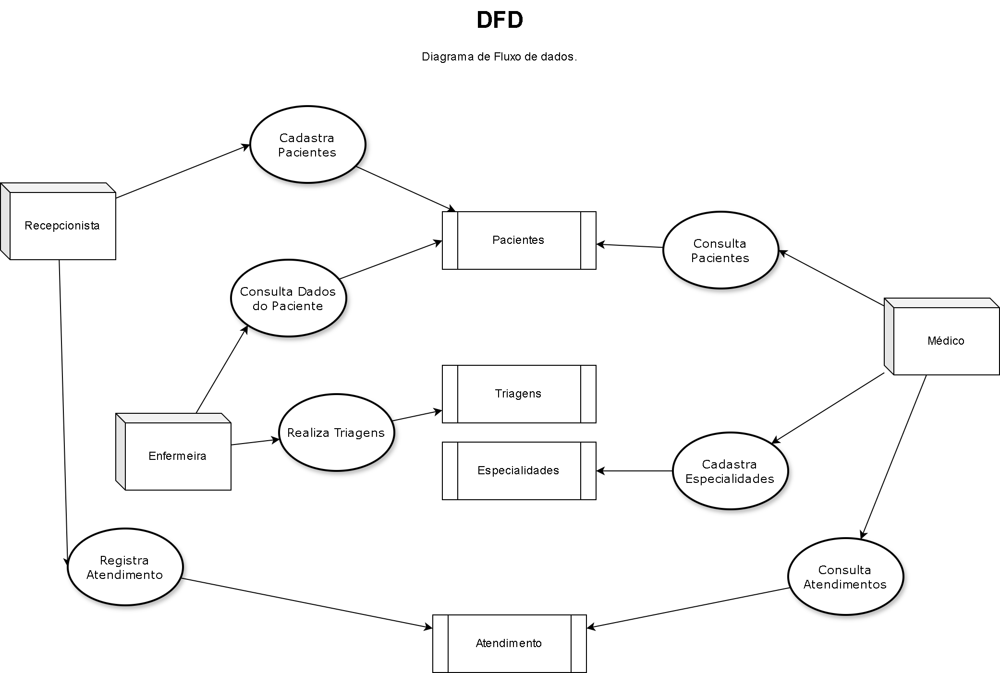
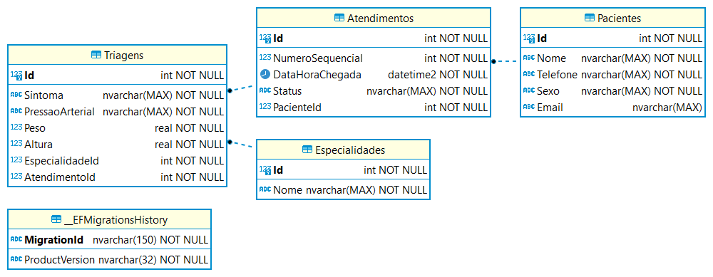
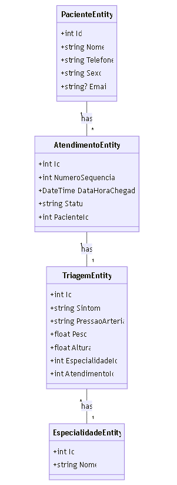

# Teste Full Stack

## Descrição

O teste possui duas aplicações:
 - API - ASP.NET Core (.NET 8.0) que fornece um serviço RESTful para gerenciamento dos dados clínicos. A API permite operações CRUD (Criar, Ler, Atualizar e Excluir).
 - FRONT - em React.

## Requisitos

- .NET 8.0
- SQL Server
- Docker
- DBeaver ou SSMS (Para execução de scripts SQL ou consultas)
- Visual Studio 2022
- VsCode
- Draw.io
- node.js e React

## Estrutura do Projeto

- **Clinica.Api**: A aplicação principal da API. (pasta backend)
- **clinica**: Frotend para interação do usuário com a API. (pasta frontend)

## Considerações do Autor

O projeto foi desenvolvido nesse formato para para dividir entre a API e Aplicação deixando a API como o CORE de operações e o Front como uma casca que pode ser aperfeiçoada ou substituída de acordo com a decisão do stakeholder sem comprometer o CORE de negócios (nesse caso, apenas o CRUD) contido na API.
Apesar de se tratar de uma POC, alguns desafios foram encontrados:
1. A questão do contêiner, pois, ao utilizar o Entity Framework no modo Code First, temos não somente a dependência da instância do SQL Server, mas, existe a opção de executar o "migration" e depois reter os scripts e carraga-los via docker-compose, ou, carregar apenas a estrutura inicial, executar o migration e rodar gerar as imagens para execução.
2. O Sql Server se mostrou um pouco instável em relação a imagem utilizada, pois, houve muita perda de conexão (possivelmente por conta do recurso da máquina utilizada ou das permissões). Numa possível mudança, optaria por utilizar Dapper e mongoDB.
3. Docker foi utilizado somente para subida da instância do SQL Server para desenvolvimento.

```diff
- Vamos logo ao que interessa!!!
```

## Sobre as aplicações

Tanto a API como o Front não exigem nenhum tipo de requisito especial para rodar.

## Composição da estrutura da Api

- .NET 8.0
- SQL Server
- CQRS
- Mediator
- AutoMapper
- IoC
- Swagger
- Unit Tests (Especialidade)

## Preparação do Banco de Dados

### Carregando a instância do SQL Server

Na pasta "packages/scripts/DDL" estão os scripts para criação de banco e de tabelas.

1_CREATE_DATABASE_ClinicaDB
```sql
CREATE DATABASE [ClinicaDB]
```

2_CREATE_TABLE___EFMigrationsHistory
```sql
USE [ClinicaDB]
GO

CREATE TABLE [dbo].[__EFMigrationsHistory](
	[MigrationId] [nvarchar](150) NOT NULL,
	[ProductVersion] [nvarchar](32) NOT NULL,
 CONSTRAINT [PK___EFMigrationsHistory] PRIMARY KEY CLUSTERED 
(
	[MigrationId] ASC
)WITH (PAD_INDEX = OFF, STATISTICS_NORECOMPUTE = OFF, IGNORE_DUP_KEY = OFF, ALLOW_ROW_LOCKS = ON, ALLOW_PAGE_LOCKS = ON, OPTIMIZE_FOR_SEQUENTIAL_KEY = OFF) ON [PRIMARY]
) ON [PRIMARY]
GO
```

3_CREATE_TABLE_Especialidades
```sql
USE [ClinicaDB]
GO

CREATE TABLE [dbo].[Especialidades](
	[Id] [int] IDENTITY(1,1) NOT NULL,
	[Nome] [nvarchar](max) NOT NULL,
 CONSTRAINT [PK_Especialidades] PRIMARY KEY CLUSTERED 
(
	[Id] ASC
)WITH (PAD_INDEX = OFF, STATISTICS_NORECOMPUTE = OFF, IGNORE_DUP_KEY = OFF, ALLOW_ROW_LOCKS = ON, ALLOW_PAGE_LOCKS = ON, OPTIMIZE_FOR_SEQUENTIAL_KEY = OFF) ON [PRIMARY]
) ON [PRIMARY] TEXTIMAGE_ON [PRIMARY]
GO
```

4_CREATE_TABLE_Pacientes
```sql
USE [ClinicaDB]
GO

SET QUOTED_IDENTIFIER ON
GO

CREATE TABLE [dbo].[Pacientes](
	[Id] [int] IDENTITY(1,1) NOT NULL,
	[Nome] [nvarchar](max) NOT NULL,
	[Telefone] [nvarchar](max) NOT NULL,
	[Sexo] [nvarchar](max) NOT NULL,
	[Email] [nvarchar](max) NULL,
 CONSTRAINT [PK_Pacientes] PRIMARY KEY CLUSTERED 
(
	[Id] ASC
)WITH (PAD_INDEX = OFF, STATISTICS_NORECOMPUTE = OFF, IGNORE_DUP_KEY = OFF, ALLOW_ROW_LOCKS = ON, ALLOW_PAGE_LOCKS = ON, OPTIMIZE_FOR_SEQUENTIAL_KEY = OFF) ON [PRIMARY]
) ON [PRIMARY] TEXTIMAGE_ON [PRIMARY]
GO
```

5_CREATE_TABLE_Atendimentos
```sql
USE [ClinicaDB]
GO

CREATE TABLE [dbo].[Atendimentos](
	[Id] [int] IDENTITY(1,1) NOT NULL,
	[NumeroSequencial] [int] NOT NULL,
	[DataHoraChegada] [datetime2](7) NOT NULL,
	[Status] [nvarchar](max) NOT NULL,
	[PacienteId] [int] NOT NULL,
 CONSTRAINT [PK_Atendimentos] PRIMARY KEY CLUSTERED 
(
	[Id] ASC
)WITH (PAD_INDEX = OFF, STATISTICS_NORECOMPUTE = OFF, IGNORE_DUP_KEY = OFF, ALLOW_ROW_LOCKS = ON, ALLOW_PAGE_LOCKS = ON, OPTIMIZE_FOR_SEQUENTIAL_KEY = OFF) ON [PRIMARY]
) ON [PRIMARY] TEXTIMAGE_ON [PRIMARY]
GO

ALTER TABLE [dbo].[Atendimentos]  WITH CHECK ADD  CONSTRAINT [FK_Atendimentos_Pacientes_PacienteId] FOREIGN KEY([PacienteId])
REFERENCES [dbo].[Pacientes] ([Id])
ON DELETE CASCADE
GO

ALTER TABLE [dbo].[Atendimentos] CHECK CONSTRAINT [FK_Atendimentos_Pacientes_PacienteId]
GO
```

6_CREATE_TABLE_Triagens
```sql
USE [ClinicaDB]
GO

CREATE TABLE [dbo].[Triagens](
	[Id] [int] IDENTITY(1,1) NOT NULL,
	[Sintoma] [nvarchar](max) NOT NULL,
	[PressaoArterial] [nvarchar](max) NOT NULL,
	[Peso] [real] NOT NULL,
	[Altura] [real] NOT NULL,
	[EspecialidadeId] [int] NOT NULL,
	[AtendimentoId] [int] NOT NULL,
 CONSTRAINT [PK_Triagens] PRIMARY KEY CLUSTERED 
(
	[Id] ASC
)WITH (PAD_INDEX = OFF, STATISTICS_NORECOMPUTE = OFF, IGNORE_DUP_KEY = OFF, ALLOW_ROW_LOCKS = ON, ALLOW_PAGE_LOCKS = ON, OPTIMIZE_FOR_SEQUENTIAL_KEY = OFF) ON [PRIMARY]
) ON [PRIMARY] TEXTIMAGE_ON [PRIMARY]
GO

ALTER TABLE [dbo].[Triagens]  WITH CHECK ADD  CONSTRAINT [FK_Triagens_Atendimentos_AtendimentoId] FOREIGN KEY([AtendimentoId])
REFERENCES [dbo].[Atendimentos] ([Id])
ON DELETE CASCADE
GO

ALTER TABLE [dbo].[Triagens] CHECK CONSTRAINT [FK_Triagens_Atendimentos_AtendimentoId]
GO

ALTER TABLE [dbo].[Triagens]  WITH CHECK ADD  CONSTRAINT [FK_Triagens_Especialidades_EspecialidadeId] FOREIGN KEY([EspecialidadeId])
REFERENCES [dbo].[Especialidades] ([Id])
ON DELETE CASCADE
GO

ALTER TABLE [dbo].[Triagens] CHECK CONSTRAINT [FK_Triagens_Especialidades_EspecialidadeId]
GO
```

Na pasta "packages/scripts/DML" estão os scripts de dados para as tabelas.

1_INSERT___EFMigrationsHistory
```sql
USE [ClinicaDB]
GO

INSERT INTO [dbo].[__EFMigrationsHistory]
           ([MigrationId], [ProductVersion])
     VALUES
           ('20241007181300_InitialMigration', '8.0.8')
GO
```

2_INSERT_Especialidades
```sql
USE [ClinicaDB]
GO

INSERT INTO [dbo].[Especialidades] ([Nome])
VALUES
    ('Cardiologia'),
    ('Pediatria'),
    ('Dermatologia'),
    ('Oftalmologia'),
    ('Ortopedia'),
    ('Ginecologia'),
    ('Psiquiatria'),
    ('Neurologia'),
    ('Endocrinologia'),
    ('Oncologia');
GO
```

3_INSERT_Pacientes
```sql
USE [ClinicaDB]
GO

-- Inserindo Pacientes
INSERT INTO [dbo].[Pacientes] ([Nome], [Telefone], [Sexo], [Email]) VALUES
('João Silva', '11987654321', 'Masculino', 'joao.silva@email.com'),
('Maria Oliveira', '11987654322', 'Feminino', 'maria.oliveira@email.com'),
('Carlos Souza', '11987654323', 'Masculino', 'carlos.souza@email.com'),
('Ana Costa', '11987654324', 'Feminino', 'ana.costa@email.com'),
('Ricardo Almeida', '11987654325', 'Masculino', 'ricardo.almeida@email.com'),
('Juliana Pereira', '11987654326', 'Feminino', 'juliana.pereira@email.com'),
('Fernando Santos', '11987654327', 'Masculino', 'fernando.santos@email.com'),
('Fernanda Lima', '11987654328', 'Feminino', 'fernanda.lima@email.com'),
('Gabriel Martins', '11987654329', 'Masculino', 'gabriel.martins@email.com'),
('Tatiane Mendes', '11987654330', 'Feminino', 'tatiane.mendes@email.com');

GO
```

4_INSERT_Atendimentos
```sql
USE [ClinicaDB]
GO

INSERT INTO [dbo].[Atendimentos]
           ([NumeroSequencial], [DataHoraChegada], [Status], [PacienteId])
     VALUES
           (1, '2024-10-07 16:50:00.0000000', 'Recepção', 6),
           (2, '2024-10-07 17:00:00.0000000', 'Recepção', 2),
           (3, '2024-10-09 19:51:00.0000000', 'Recepção', 5),
           (4, '2024-10-07 19:54:00.0000000', 'Recepção', 10)
GO
```

5_INSERT_Triagens
```sql
USE [ClinicaDB]
GO

INSERT INTO [dbo].[Triagens]
           ([Sintoma], [PressaoArterial], [Peso], [Altura], [EspecialidadeId], [AtendimentoId])
     VALUES
           ('Febre', '14/8', 4.0, 3.0, 5, 14)
GO
```

Esses scripts são a estrutura para o seguinte diagrama de fluxo de dados, DFD:



Abaixo temos a representação mais específica do modelo MER:



E também a representação do Diagrama de Classes:



## Evidências de Execução

Após o desenvolvimento, foi realizado alguns testes de execução.
Para não ficar muito estendido, o teste foi reduzido a Especialidade na API e no Front foi realizado o teste até a Triagem.

```diff
- Observação: por conta do notebook utilizado, os testes a partir da Triagem não foram bem sucedidos porque a máquina estava travando, uma vez que não é uma máquina apropriada para rodar os testes no nível que era exigido.
```

- API - Evidências

<video width="800" height="600" controls>
  <source src="https://github.com/jmsaka/teste-aplicativo-net/raw/refs/heads/main/assets/API.mp4" type="video/mp4">
</video>
https://github.com/jmsaka/teste-aplicativo-net/raw/refs/heads/main/assets/API.mp4

[Baixar vídeo](https://github.com/jmsaka/teste-aplicativo-net/raw/refs/heads/main/assets/API.mp4)


- Front - Evidências

<video width="800" height="600" controls>
  <source src="[assets/App.mp4](https://github.com/jmsaka/teste-aplicativo-net/raw/refs/heads/main/assets/App.mp4)" type="video/mp4">
</video>

[Baixar vídeo](https://github.com/jmsaka/teste-aplicativo-net/raw/refs/heads/main/assets/App.mp4)

## Considerações do Autor

- Para desenvolvimento de toda a estrutura e documentos, utilizei exta a tarde após as 16h até as 22h, sábado, após as 13h, e segunda o dia todo.
- Não foi possível ficar diretamente focado por conta de compromissos pessoais e de família.
- A máquina que estou usando nesse momento não ajuda muito em termos de desempenho e isso dificultou muito o desenvolvimento uma vez que ficava travando. (para isso, já estou providenciando uma máquina que atenda)
